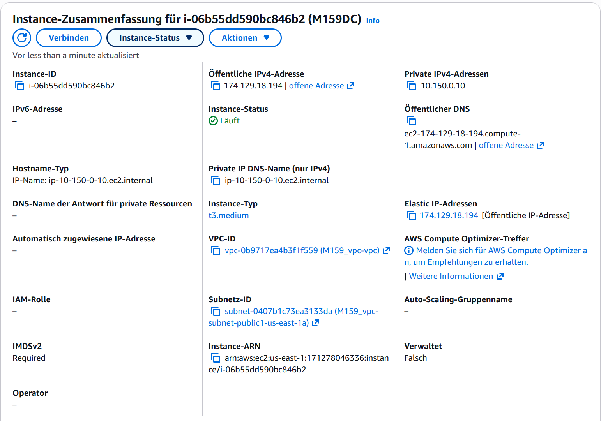
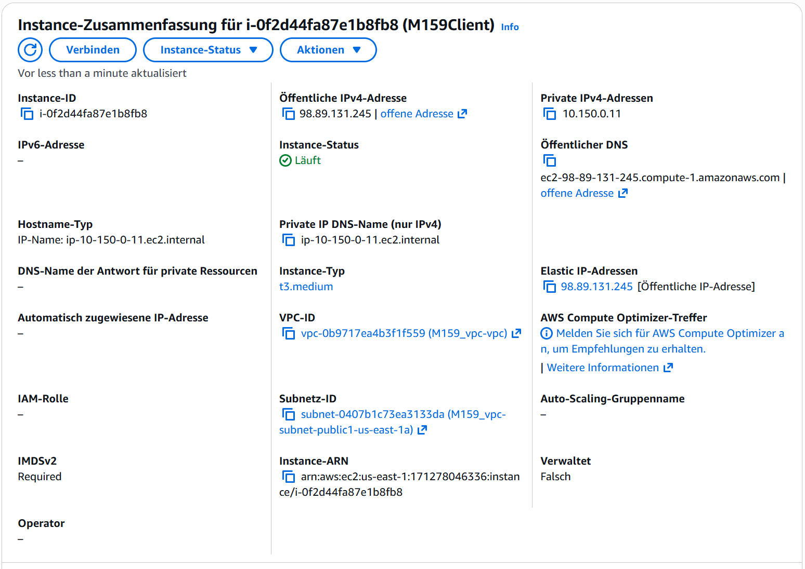

### Das ist die Domain Controller Instance

Bei dem Domain Controller habe ich den Namen wie vorher gelassen.
### Das ist der Client

Der Hostname für diesen Client ist M159Client

## AWS-EC2 Setup & Windows-Grundkonfiguration

Ich habe gemäss meiner Planung eine eigene VPC mit öffentlichen und privaten Subnetzen erstellt und passende Security Groups konfiguriert. Danach habe ich die EC2-Instanzen mit den geplanten IP-Adressen erstellt und die Hostnames korrekt gesetzt.

Auf den Windows-Servern habe ich das Ping-Protokoll erlaubt, das Tastaturlayout auf CH geändert und beim Desktop-Server die verstärkte Sicherheitskonfiguration für IE deaktiviert. Zudem wurde IPv6 deaktiviert, die Anzeige- und Ordneroptionen angepasst (alle Dateien sichtbar, Erweiterungen eingeblendet, Freigabeassistent aus). Abschliessend habe ich Verknüpfungen für CMD und PowerShell sowie Desktopsymbole (Dieser PC, Systemsteuerung, Netzwerk) hinzugefügt.