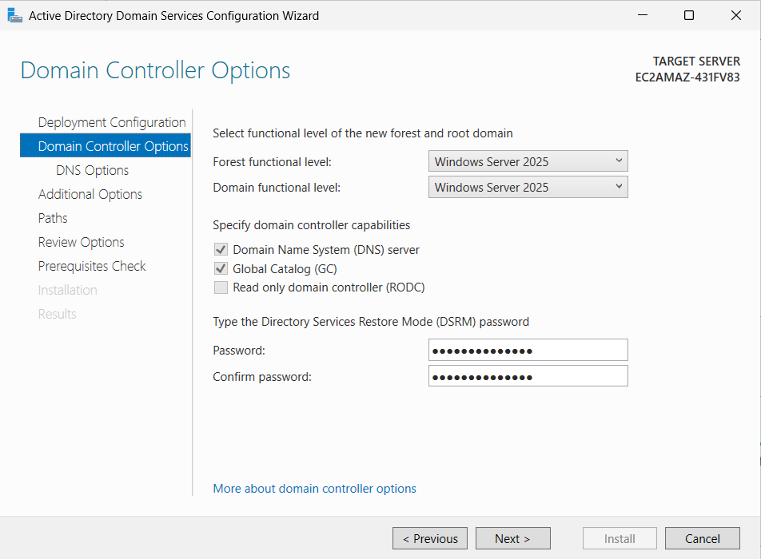
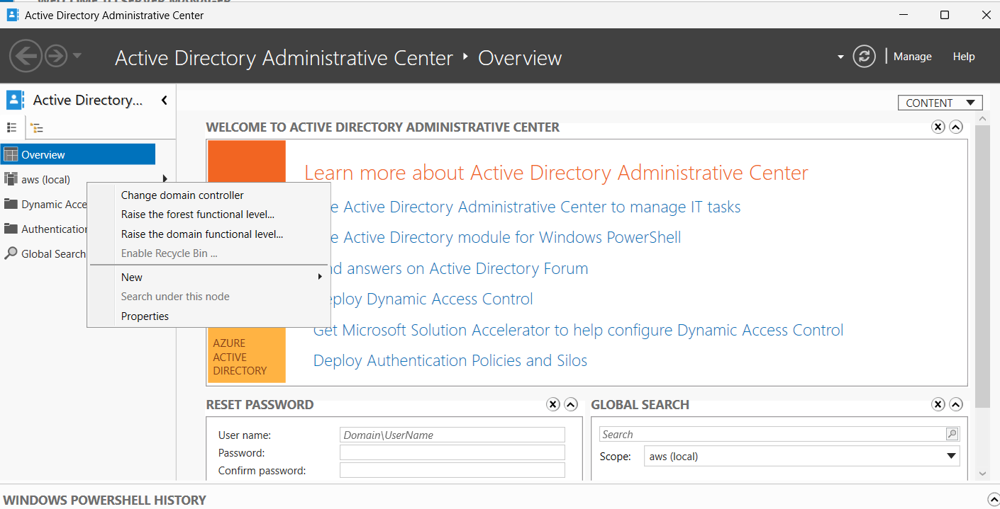
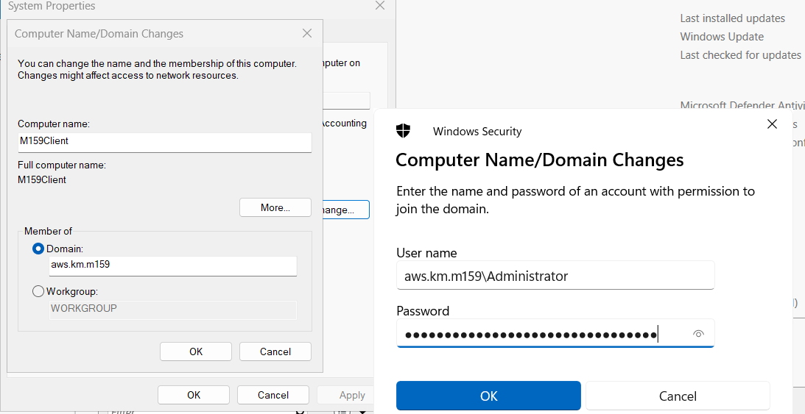
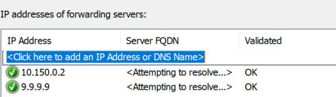
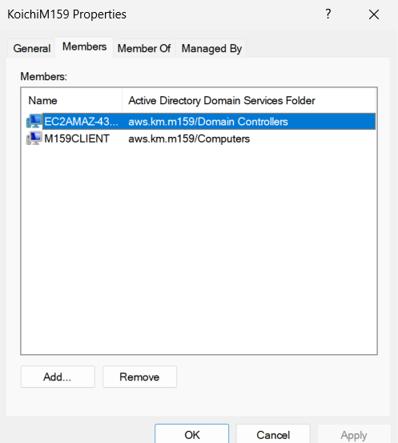
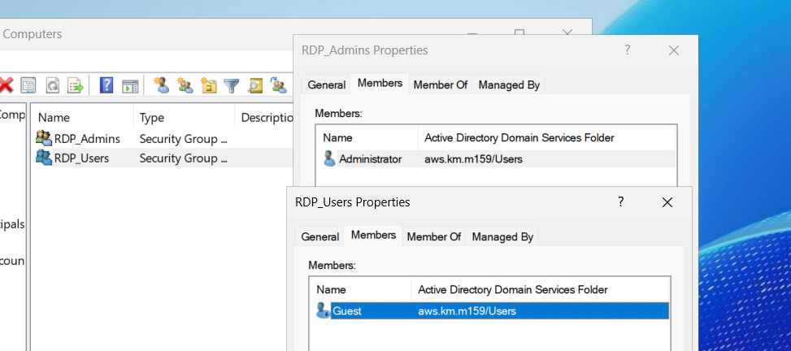
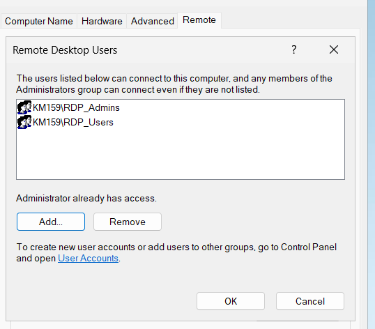

#### 9.9.9.9 (Quad9) vs. 8.8.8.8 (Google DNS)
 
- **Datenschutz:** Quad9 ist Non-Profit (Schweiz) und speichert keine Nutzerdaten → besserer Datenschutz.  
- **Sicherheit:** Quad9 blockiert automatisch schädliche Domains.  
- **Geschwindigkeit:** Google DNS ist meist minimal schneller.  
- **Fazit:** Quad9 = sicherer & privater, Google = etwas schneller.
- 
- 
- 
- 
- 
