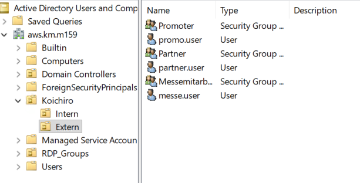
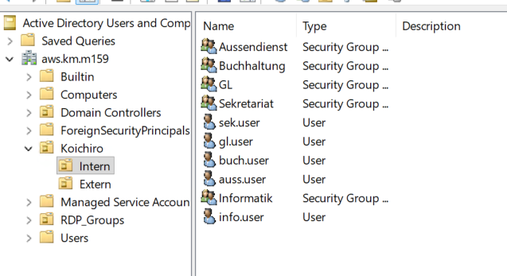
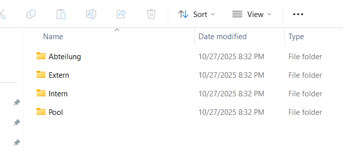
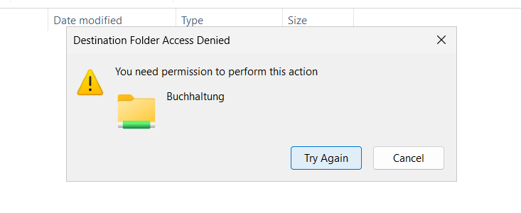
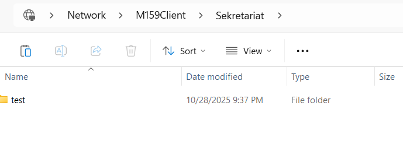
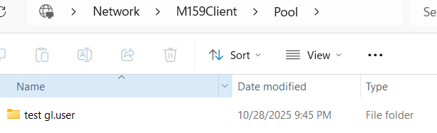
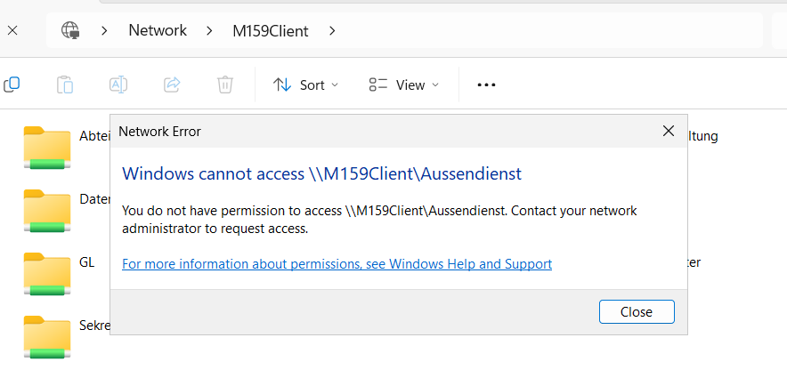
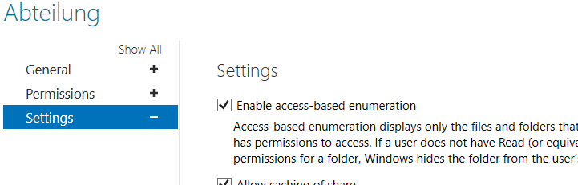
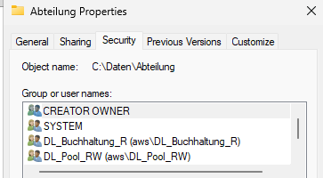
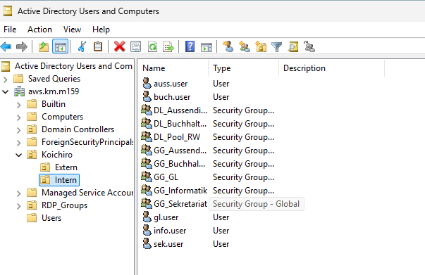

# Freigabe Laufwerk
Ich habe im Active Directory alle Benutzer und Gruppen gemäss Planung erstellt. Die internen Abteilungen (GL, Sekretariat, Buchhaltung, Informatik) und externen Abteilungen (Promoter, Partner, Messemitarbeiter) wurden in separate OUs (Intern / Extern) unter „Koichiro“ eingeordnet.
Auf dem Fileserver (M159Client) habe ich die Ordnerstruktur (Abteilung, Intern, Extern, Pool) erstellt und die Freigaben sowie NTFS-Berechtigungen nach der Matrix gesetzt.
Beim Testen funktionierten die Berechtigungen wie geplant:

Benutzer aus dem Sekretariat konnten auf ihren Ordner zugreifen.

Zugriff auf „Buchhaltung“ wurde verweigert (Access Denied).

Benutzer aus „GL“ konnten im Pool-Ordner Dateien erstellen.
Anschliessend wurde Access-Based Enumeration (ABE) aktiviert, sodass Benutzer nur ihre eigenen freigegebenen Ordner sehen.

