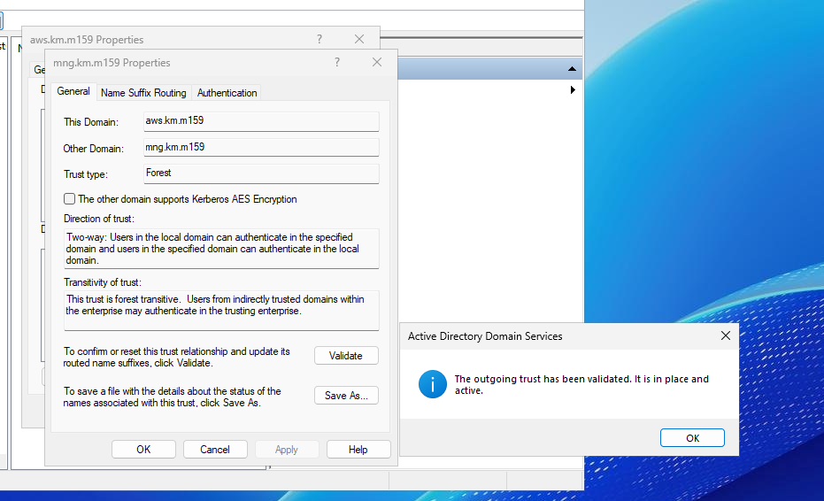

# AWS

#### Passwort für AWS Managed AD-Setup = Pa55word.1
Ich habe das AWS Managed AD eingerichtet und mit meinem EC2 Active Directory verbunden. Danach habe ich den Conditional Forwarder erstellt, um die DNS-Auflösung zwischen den Domains zu ermöglichen. Anschliessend richtete ich den Trust auf beiden Seiten ein und validierte ihn erfolgreich – die Verbindung zwischen beiden ADs funktionierte.

