# DIT und GPO 
Teil 1: Passwortrichtlinien
Ich habe in der Default Domain Policy die Passwortkomplexität deaktiviert und das Erzwingen einer Passwortänderung entfernt. Diese Änderungen gelten nur für die Testumgebung.

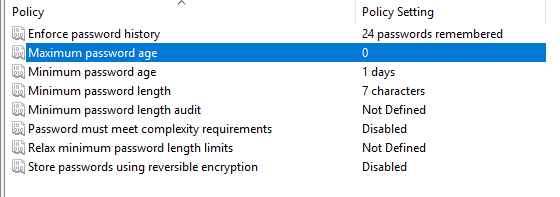
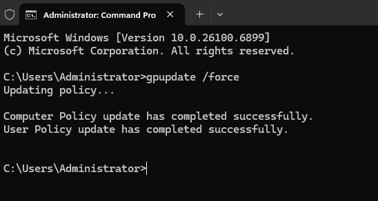

Teil 2: Netzlaufwerke per GPO
Ich habe GPOs erstellt, um Netzlaufwerke automatisch zu verbinden. Dabei gibt es ein gemeinsames Laufwerk „Pool“ und je ein Abteilungslaufwerk für interne und externe Abteilungen. Die GPOs wurden direkt mit den passenden OUs verknüpft.
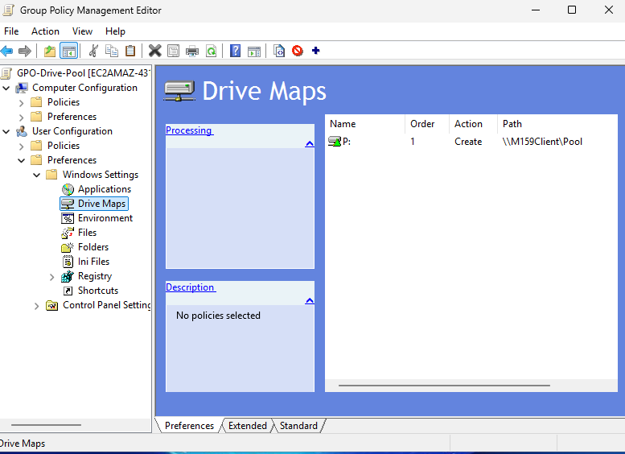
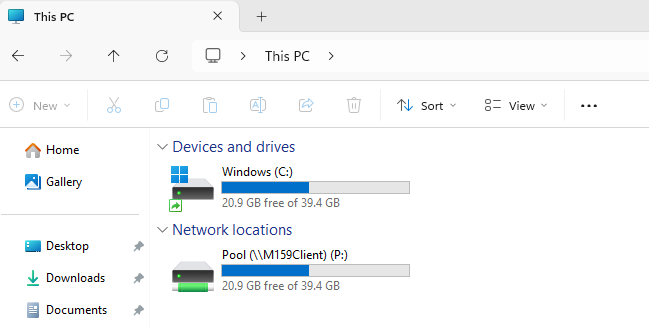

Teil 3: Desktop-Verknüpfung (positive Filterung)
Ich habe ein GPO erstellt, das eine Desktop-Verknüpfung zum Web-CRM anlegt. Dieses GPO ist auf oberster Ebene verknüpft und über Sicherheitsfilterung nur für die internen Gruppen aktiv.

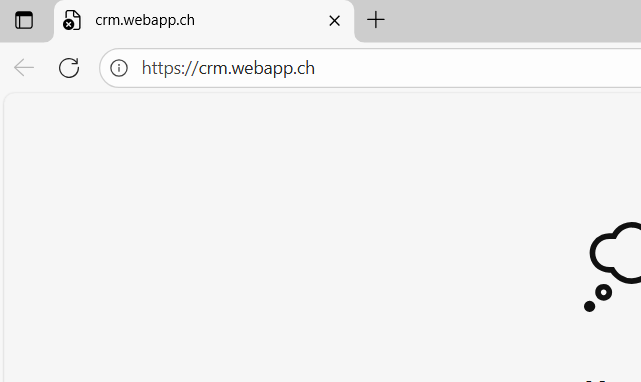
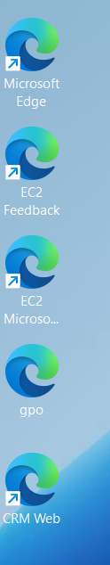

Teil 4: WMI-Filter (Windows 10)
Ich habe einen WMI-Filter erstellt, der nur Windows-10-Clients erkennt. Das GPO „Textdatei kopieren“ kopiert eine Datei von der Freigabe Pool nach %temp% bei allen Benutzern der OU Promoter. Die Auswertung habe ich mit gpresult /h gpo.html exportiert.
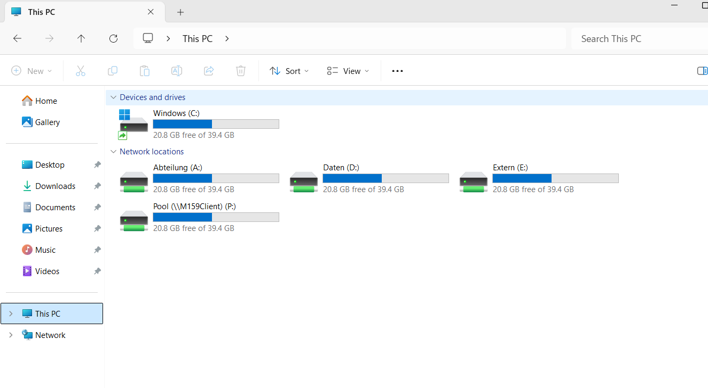
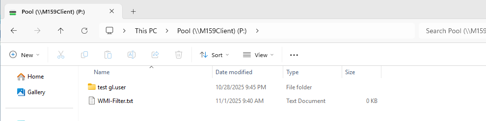

Teil 5: Drucker verteilen
Ich habe zwei fiktive Drucker eingerichtet: Drucker_Farbe und Drucker_SW. Beide wurden freigegeben und per GPO über UNC-Pfad verteilt. Die Funktion habe ich getestet, indem ich die Drucker gelöscht und mit gpupdate /force neu hinzugefügt habe.
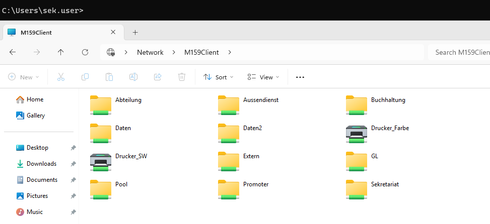
<video controls src="2025-11-01 23-40-10 (1).mp4" title="Title"></video>

Teil 6: 7-Zip per GPO
Ich habe ein MSI-Paket von 7-Zip auf einer Freigabe bereitgestellt und ein GPO zur automatischen Installation auf Domain-Computern erstellt. Nur Computer in der Security Group „7-Zip“ erhalten die Software. Die erfolgreiche Installation habe ich über das Eventlog überprüft.
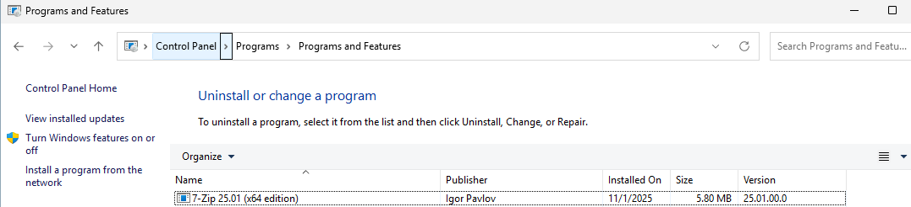
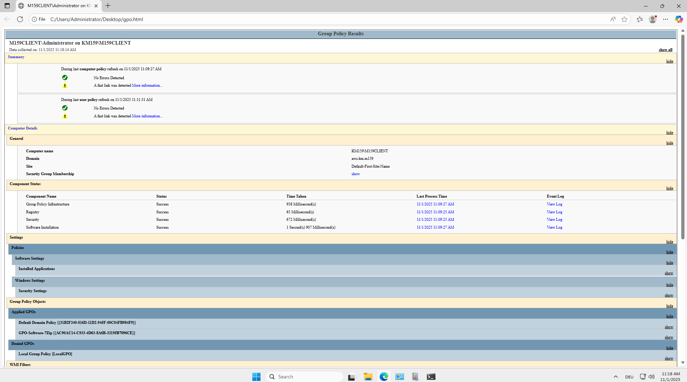
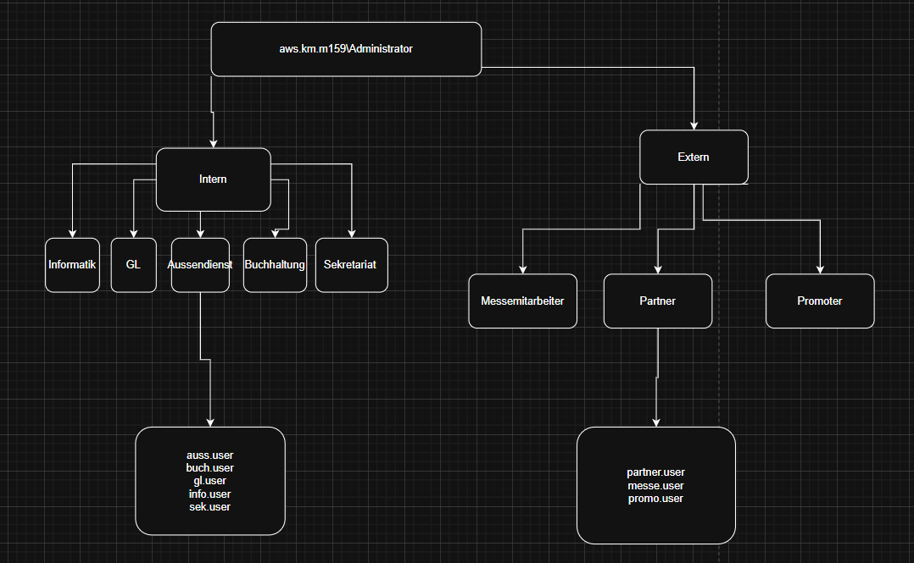
